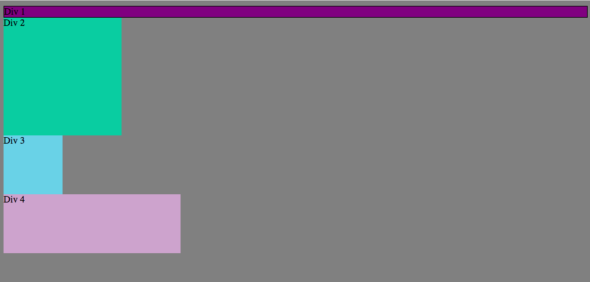
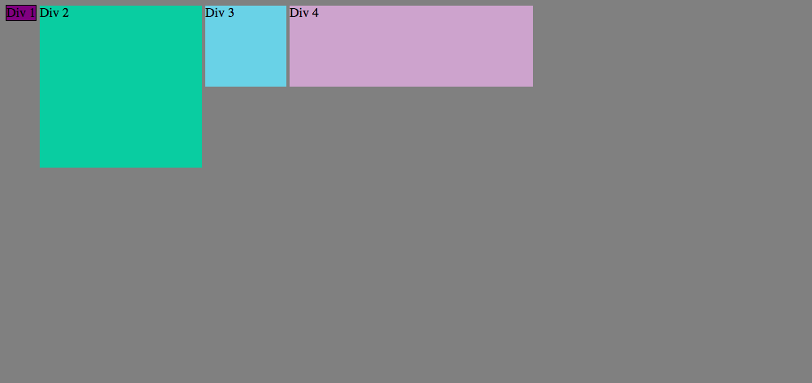
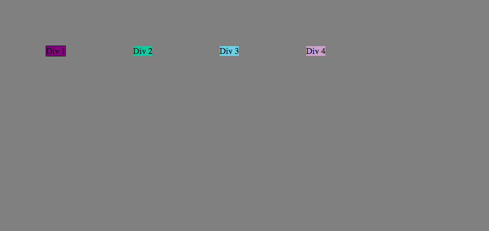
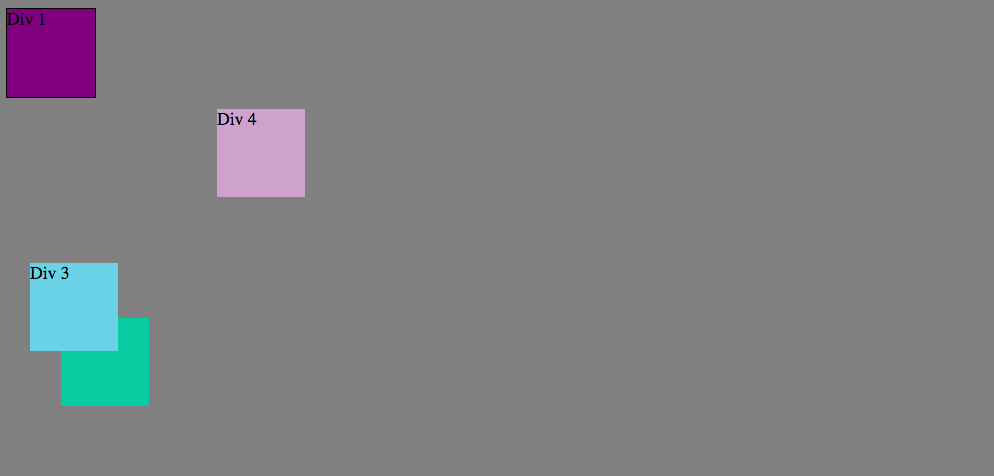
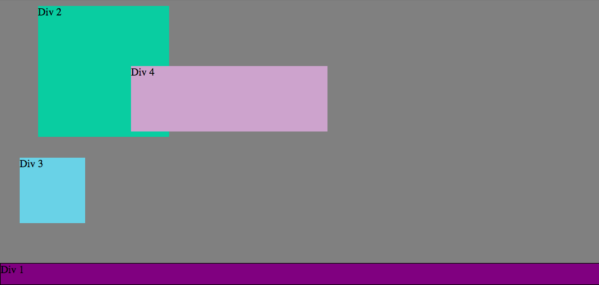
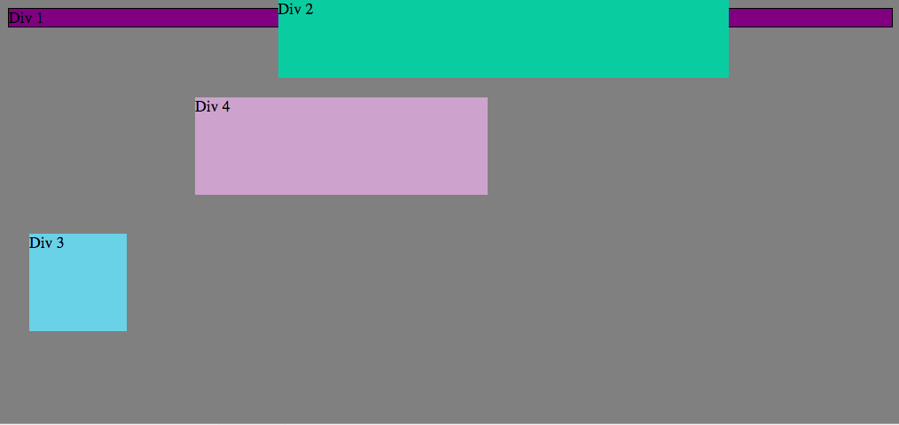
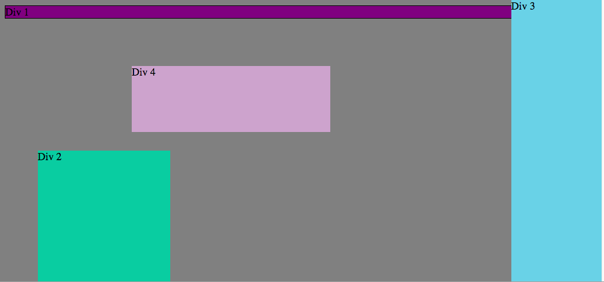
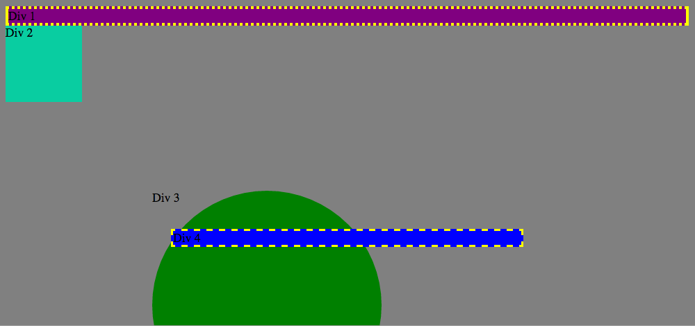

How can you use Chrome's DevTools inspector to help you format or position elements?
I can use DevTools to zero in on a specific element on a page that I need to format. In addition Devtools provides an instatnt preview of the changes made so I can see whether my formating has been successful or if I should try something else. 

How can you resize elements on the DOM using CSS?
I can use tools within CSS such as border, margin, padding, position, and many others to modify individual elements on the page or a combination of elements with a use of class. 

What are the differences between Absolute, Fixed, Static, and Relative positioning? Which did you find easiest to use? Which was most difficult?
Static position is default and it lacks any positioning guidelines. It will display elements in a natural flow of page. 
Relative will modify an elements position based on its original place on a page. 
Fixed will place an element somewhere on a page and will keep it there regardless of screen size, scrolling, resizing of page. 
Absolute will position an element relative to its parent element or it will use document body if no parent element exists. it will move with scrolling unlike fixed. 

What are the differences between Margin, Border, and Padding?
What was your impression of this challenge overall? (love, hate, and why?)
Margin is used to clear or size an area around the target element which lies outisde its "border". Four values can be entered to indicate top/right/bottom/left spacing. 
Border can be transparent or set to be seen on the page. It can take attributes of size of the border as well as style: dotted/dashed/solid/double. 
Padding is used to manipulate the space between the content and its border. It can be defined as a percantage or specific length. 